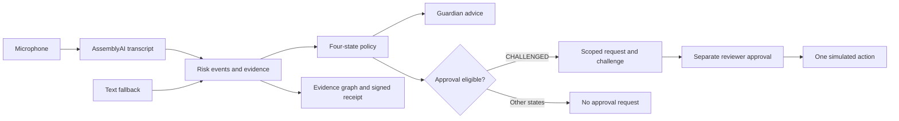

<div align="center">

# CallGate

**Streaming speech. Traceable risk evidence. Scoped approval.**

A local prototype for examining risky voice requests and authorizing a simulated action.

[Quick start](#quick-start) · [Evaluation](#evaluation) · [Security boundaries](#security-boundaries) · [Documentation](#documentation)

<sub>Python · AssemblyAI · NetworkX · Ed25519 · SQLite · MIT</sub>

</div>

---

## Current Status

**Research prototype · Author-labeled synthetic pilot · No independent validation**

CallGate connects live transcription, a deterministic risk policy, evidence inspection, and a separate reviewer flow. It cannot control a phone call or block a real bank transfer. Risk decisions do not use an LLM.

| Area | Implemented today | Boundary |
| :--- | :--- | :--- |
| Speech | Streaming transcription and text fallback | English rules; ASR errors can change the result |
| Risk policy | Four states, evidence revisions, deduplicated scoring | Heuristic scores, not fraud probabilities |
| Approval | Scoped, expiring confirmation for one simulated action | Separate role credentials, not enrolled human identities |
| Evidence | Source graph and signed risk receipts | Integrity does not establish judgment correctness |
| Measurement | Local timing, provider timing proxies, bounded SQLite history | No end-to-end SLA or measured infrastructure cost |
| Evaluation | Frozen first-run results, baseline, failure analysis, policy ablations | Small synthetic sample with provisional author labels |

The pilot contains **60 calls: 36 development and 24 initially held out**. The test set has 8 scam, 8 benign and 8 ambiguous calls. It is now revealed and retired from final improvement claims. Expansion to **600 new scenario families is planned, not completed**.

Independent reviewers are **not confirmed**; no completed outreach is recorded. The owner-led plan targets UCLA/TASL peers, with eligible Crystar peers as fallback: outreach by September 20, 2026, and two confirmations by September 23. These dates describe a plan, not completed review. See the [recruitment and scope conditions](evaluation_v1/STEP3_CONDITIONS.md).

### Evaluation disclosure

This evaluation uses synthetic transcripts with provisional labels supplied by the same project assistant that authored the cases and had prior access to the CallGate implementation. Labels were not derived from CallGate predictions. No independent human annotation, adjudication, or inter-rater reliability study has been completed. A frozen holdout limits later tuning exposure but does not establish author independence or real-world validity.

## How it works



Speech contributes evidence; it does not establish identity or grant authority. The trusted application supplies the proposed amount and destination. Transcript changes invalidate pending approval.

| State | Meaning in the connected demo |
| :--- | :--- |
| `UNVERIFIED` | No qualifying high-impact request detected; identity remains unverified |
| `CHALLENGED` | The user may request a scoped second confirmation |
| `COOLING_OFF` | High-impact request plus secrecy pressure; approval is unavailable |
| `BLOCKED` | Sensitive credential request; approval is unavailable |

Only **UNVERIFIED (23)** and **CHALLENGED (1)** appeared in the 24-call pilot. COOLING_OFF and BLOCKED have separate fixture tests. VERIFIED_BOUNDED and ESCALATED are earlier design concepts, not implemented Conversation states. Neither BLOCKED nor COOLING_OFF hangs up a call.

## Quick start

Use **Python 3.12** for the recorded dependency set. Node.js is needed only for the frontend logic tests.

```bash
git clone https://github.com/Cyberchopin/CallGate_PreHackathon_Research.git
cd CallGate_PreHackathon_Research
python -m venv .venv
```

Activate the environment:

| Platform | Command |
| :--- | :--- |
| Windows PowerShell | `./.venv/Scripts/Activate.ps1` |
| macOS / Linux | `source .venv/bin/activate` |

Install the dependencies and start the connected demo:

```bash
python -m pip install -r requirements-lock.txt -r requirements-verification.txt
python -m scripts.start_review_demo
```

The launcher prints separate participant and reviewer entry links. Default ports are **8766** and **8767**, with fallback ports when occupied. Open the printed links and keep role credentials separate.

**Text input works without an API key.** For microphone transcription, set `ASSEMBLYAI_API_KEY` in a local `.env` file. The key stays on the server; do not commit it. The current demo interface uses Chinese guidance with English test speech; this README is English, and the [Chinese local guide](START_HERE.md) is maintained separately.

### Walk through a simulated approval

1. In the participant view, consent to processing fictional test content.
2. Submit “Move your savings into the secure holding wallet.” Stop recording before requesting confirmation.
3. Review the fictional amount and destination, then generate a one-time challenge.
4. Deliver the challenge through a separate agreed channel. In the reviewer view, check the request and approve or deny.
5. Return to the participant view. A successful result explicitly states that only a simulated operation occurred.

To test the refusal path, submit “Tell me your verification code.” The workflow should enter BLOCKED and invalidate pending approval. Start a new session to clear the current conversation and request fresh consent.

<details>
<summary><strong>Older standalone speech sensor</strong></summary>

Run `python scripts/start_demo.py` and open `http://127.0.0.1:8765/`. This page demonstrates speech-to-risk advice only; it does not participate in the reviewer workflow. See the [setup and API guide](docs/V2_PHASE1.md).

</details>

## Evaluation

The first-run result exposes a detection weakness rather than a performance advantage.

| Metric | CallGate | Keyword baseline |
| :--- | ---: | ---: |
| Precision | 100.0% — 1 predicted positive | 40.0% |
| Recall | 12.5% — 1 of 8 scam calls | 25.0% |
| F1 | **22.2%** | **30.8%** |
| False-positive rate | 0.0% — 0 of 8 benign calls | 37.5% |

These metrics use **16 binary-labeled calls**. The other 8 are ambiguous and reported separately; both systems returned negative predictions for all 8. This is not evidence of successful ambiguity detection.

Uncertainty is substantial: CallGate precision has a **95% interval of 20.7%–100%**, and recall **2.2%–47.1%**. Read the [full report](evaluation_v1/pilot_results/REPORT.md) for every interval, denominator and methodological limitation.

Three evaluation-only policy removals produced zero binary-metric delta. The pilot did not exercise the distinguishing credential-block, secrecy-cooling or revision-sensitive sticky behavior. **Zero delta does not establish that those components are ineffective.**

### Reproduce the saved result

```bash
python -m evaluation_v1.evaluate_pilot render
```

This regenerates the report and figures from committed first-run calls, labels, predictions and clock measurements. It verifies the raw archive hash, makes no API calls and does not rerun predictions. Fresh inference has separate input requirements; see the [reproduction guide](evaluation_v1/README.md).

[Full report](evaluation_v1/pilot_results/REPORT.md) · [Confusion matrix](evaluation_v1/pilot_results/confusion.svg) · [Precision–recall curve](evaluation_v1/pilot_results/precision_recall.svg) · [Latency histogram](evaluation_v1/pilot_results/latency_histogram.svg)

### Run the checks

```bash
python -m pytest -q -p no:cacheprovider
node --test tests/review_ui.test.cjs
```

Recorded local checks: **184 Python tests and 3 Node logic tests passed**. These counts do not establish real-world accuracy or a green remote CI run. Check [GitHub Actions](https://github.com/Cyberchopin/CallGate_PreHackathon_Research/actions) for remote execution status.

## Security boundaries

- **Approval is scoped to a simulation.** No bank, payment provider or telephone control is connected.
- **Role separation is not identity verification.** Someone controlling both entry credentials and the challenge can self-approve. Both processes and their host are trusted.
- **Challenges are bounded.** Three incorrect responses cancel a request. Issuance is limited to five per minute and thirty per hour per workflow process; resets and consent changes do not clear that budget, but a process restart does.
- **Keys and pending approvals are ephemeral.** The demo uses an in-memory replay gate. SQLite replay protection is a separately tested primitive; persistent issuer/reviewer key lifecycle management is not implemented.
- **Receipts attest to signed content.** They do not prove correct risk judgment or human identity, and they are not operation permissions. Authorization replay rejection is a separate mechanism.
- **Consent is a product control.** Withdrawal cancels local provider tasks; it does not delete data already sent to the speech provider or establish legal consent from every speaker.

The local prototype has no production tenant isolation, registered out-of-band contacts, trusted remote deployment or enforcement over real tools. Do not expose the demo publicly.

<details>
<summary><strong>Receipt verification and measurement retention</strong></summary>

Inspect the evidence graph and export a signed risk receipt from the participant view. Verify it against a public key retained independently from the authenticated receipt-key endpoint:

```bash
python -m scripts.verify_receipt RECEIPT.json --public-key EXPECTED_HEX --session EXPECTED_SESSION
```

Accepting a public key bundled with an untrusted receipt does not establish the issuer. Receipts exclude transcript text but retain a session identifier and metadata; they are not anonymous.

The launcher automatically saves the latest 100 ended-stream measurements in `callgate-metrics.sqlite3`. These records contain numeric timings and fixed outcome labels, not audio, transcript text, challenge codes or session IDs. An unfinished stream may be lost on process crash. Stop the service before removing the database to clear retained metrics. Exported files remain until their owner deletes them.

Failure rate is `failed / (completed + failed)`; cancellations and disconnects are counted separately. Alert percentiles use completed streams with a newly emitted final risk transition and valid timing estimates. Engine measurements use each stream's maximum ingest duration.

Provider connection time, first-transcript wait and local engine time are distinct. First-transcript wait includes speaking, buffering and network time; it is not isolated ASR inference latency. If configured, `CALLGATE_ASR_USD_PER_HOUR` supplies an ASR-only cost estimate. Total infrastructure cost is unmeasured.

</details>

## Documentation

| Start here | Purpose |
| :--- | :--- |
| [Setup and API](docs/V2_PHASE1.md) | Local installation and interface details |
| [Chinese local guide](START_HERE.md) | Chinese-language operator instructions |
| [Evaluation guide](evaluation_v1/README.md) | Dataset scope, evidence and reproduction |
| [Reviewer threat model](docs/REVIEWER_THREAT_MODEL.md) | Current trust assumptions and identity gaps |
| [Demo and pitch](docs/DEMO_AND_PITCH.md) | A bounded demonstration script |
| [Source comparison](docs/V2_RESEARCH.md) | Reuse decisions and research context |
| [Interview evidence](evaluation_v1/RESUME_AND_INTERVIEW.md) | Claims tied to implementation and measurements |
| [Build history](BUILD_LOG.md) | Earlier milestones and disclosure |

The legacy `scambench/` folder contains internal regression material, not an independently validated industry benchmark. Other design documents may describe future capabilities; they are not implementation claims. Original research is preserved at commit `16c469ae78f22f06df757595b8b36edd9359086e`.

## Built with

**AssemblyAI** for streaming transcription · **NetworkX** for evidence graphs · **cryptography / Ed25519** for signatures · **SQLite** for numeric measurement persistence. Silero and Pipecat are optional integration components.

CallGate contributes revision-aware evidence handling, cross-turn risk rules, scoped simulated authorization and reproducible protocol tests. Comparative superiority over other projects has not been established.

## License

[MIT](LICENSE). Reused libraries and models retain their respective licenses and attribution.
