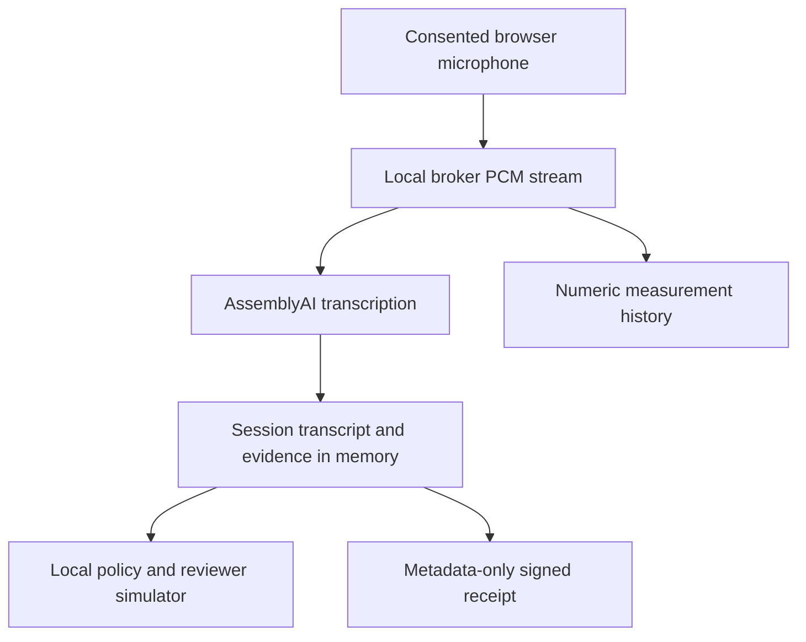

# Privacy, processing consent and unresolved legal questions

This is an implementation inventory, not a privacy certification or legal opinion.

## Data flow

Text fallback enters the broker directly and does not call the transcription API. See `callgate/review_transport.py` and `callgate/workflow.py`.

## Implemented behavior versus gaps

| Topic | Observed behavior | Gap / limit |
|---|---|---|
| Processing consent | Explicit participant choice; microphone start checks processing status | A participant's choice does not prove all speakers consented |
| Withdrawal | Workflow invalidates pending request and discards current conversation; broker cancels active tasks | Provider-side deletion, secure memory erasure and deletion of exports are NOT IMPLEMENTED |
| Raw audio | Streaming transport; inspected path does not intentionally write PCM files | A verified audio TTL / memory wipe guarantee is NOT IMPLEMENTED; OS/provider buffers are outside this control |
| Transcript | Conversation and UI retain current session text | Automatic elapsed-time retention expiry is NOT IMPLEMENTED |
| Reset | New session and consent; prior confirmation invalidated | Does not delete independently downloaded files or prove provider erasure |
| Receipts | Exclude raw transcript text; include session identifiers and metadata | Metadata is not anonymous; recipient controls downloaded files |
| Measurements | SQLite numeric records and outcome labels; no transcript or challenge content in these records | Owner must stop service and delete database to clear retained measurements |
| Provider | Audio leaves local host for configured transcription service | Current contractual retention, training use, regional processing and deletion guarantees are UNVERIFIED |
| Contacts | Manually delivered challenge and local role credentials | Enrolled identities, safe family routes and device revocation are NOT IMPLEMENTED |
| Deployment | Guarded loopback services | Production tenancy, remote authorization and cross-device HTTPS enrollment are NOT IMPLEMENTED |

Sources: `callgate/workflow.py:set_processing_consent/reset_session`, `callgate/review_transport.py:stop_audio/audio`, `callgate/receipt.py:ReceiptPayload`, `callgate/live_metrics.py`, `scripts/start_review_demo.py`.

## Operator consent procedure

- Use fictional, consensually read test content only.
- Explain audio is sent to the configured third-party transcription service.
- Obtain processing agreement before enabling microphone capture.
- If anyone refuses or withdraws, stop processing; use synthetic text instead.
- Do not imply the local consent button resolves recording law.
- Do not enter victim stories, actual financial details, credentials or personal records.
- Do not commit API keys, voice files, exports with sensitive data or identity contacts.

## Questions for qualified legal/privacy reviewers

- Which jurisdictions apply when callers and recipients are in different states or countries?
- Is a transcription stream treated as recording, interception or another regulated processing activity?
- What notices and consent are required from each participant?
- What special rules apply to minors, healthcare data, disability-related data or financial information?
- What retention, access, deletion and breach obligations would apply to deployment partners?
- What do current provider terms permit for storage, model training, regional processing and subprocessors?
- How should withdrawal affect data already transmitted, exports and audit receipts?
- What disclosures are required before an automated agent intervenes in a live call?

No answer is implied by this list. Obtain qualified review before real-call use.
