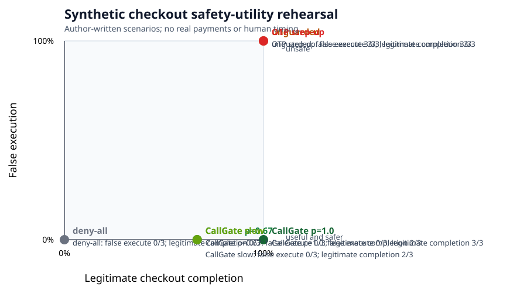

# Checkout safety-utility rehearsal

Synthetic author-provided checkout rehearsal. No real payments, no independent labels, no population claim.

| System | False execute | Legitimate completion | Median verify ms | P95 verify ms |
|---|---:|---:|---:|---:|
| deny_all | 0/3 (0.0%) | 0/3 (0.0%) | None | None |
| unguarded_checkout | 3/3 (100.0%) | 3/3 (100.0%) | 0 | 0 |
| callgate | 0/3 (0.0%) | 3/3 (100.0%) | 24000 | 30000 |

Wilson intervals are included in the JSON for descriptive proportions only.
Reviewer timing is a synthetic parameter, not measured human response time.
Deny-all has no unauthorized execution in this rehearsal, but also no legitimate completion.
Unguarded checkout completes every scenario, including unauthorized ones.
