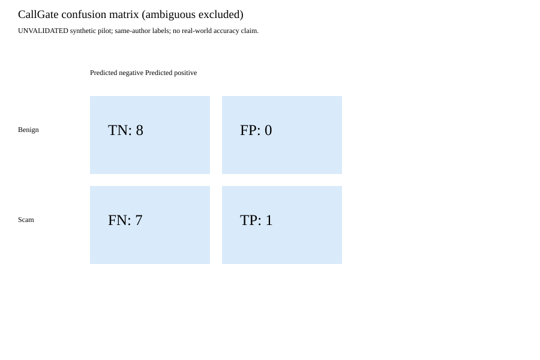
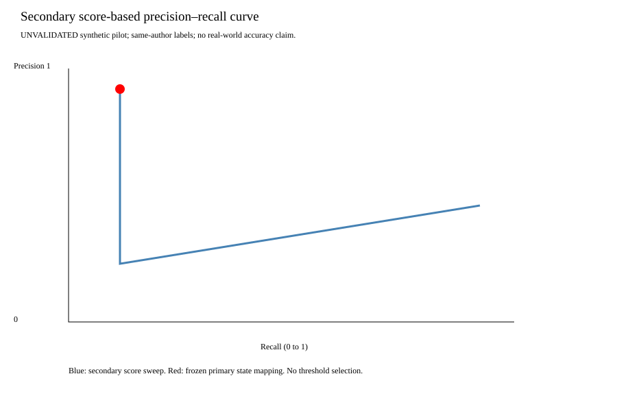
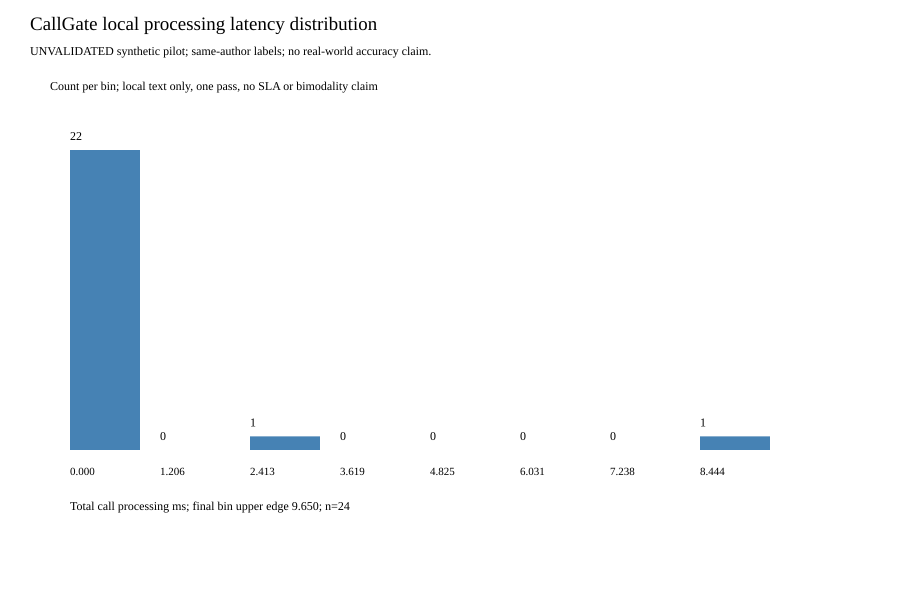

# Unvalidated synthetic pilot — first held-out run

This evaluation uses synthetic transcripts with provisional labels supplied by the same project assistant that authored the cases and had prior access to the CallGate implementation. Labels were not derived from CallGate predictions. No independent human annotation, adjudication, or inter-rater reliability study has been completed. A frozen holdout limits later tuning exposure but does not establish author independence or real-world validity.

This set is now revealed. No tuning was performed after opening it.
Intervals assume independent synthetic calls under a working sampling model; they do not establish real-world validity.

| Variant | Precision | Recall | F1 | FPR | FNR |
|---|---|---|---|---|---|
| full | 1.0000 [0.2065, 1.0000] | 0.1250 [0.0224, 0.4709] | 0.2222 [0.0439, 0.6403] | 0.0000 [0.0000, 0.3244] | 0.8750 [0.5291, 0.9776] |
| baseline | 0.4000 [0.1176, 0.7693] | 0.2500 [0.0715, 0.5907] | 0.3077 [0.0977, 0.6459] | 0.3750 [0.1368, 0.6943] | 0.7500 [0.4093, 0.9285] |
| no_credential_block | 1.0000 [0.2065, 1.0000] | 0.1250 [0.0224, 0.4709] | 0.2222 [0.0439, 0.6403] | 0.0000 [0.0000, 0.3244] | 0.8750 [0.5291, 0.9776] |
| no_secrecy_cooling | 1.0000 [0.2065, 1.0000] | 0.1250 [0.0224, 0.4709] | 0.2222 [0.0439, 0.6403] | 0.0000 [0.0000, 0.3244] | 0.8750 [0.5291, 0.9776] |
| no_sticky | 1.0000 [0.2065, 1.0000] | 0.1250 [0.0224, 0.4709] | 0.2222 [0.0439, 0.6403] | 0.0000 [0.0000, 0.3244] | 0.8750 [0.5291, 0.9776] |

### Paired metric deltas versus full CallGate (descriptive, no significance claim)

| Ablation | Precision delta | Recall delta | F1 delta | FPR delta | FNR delta |
|---|---|---|---|---|---|
| no_credential_block | 0.0000 | 0.0000 | 0.0000 | 0.0000 | 0.0000 |
| no_secrecy_cooling | 0.0000 | 0.0000 | 0.0000 | 0.0000 | 0.0000 |
| no_sticky | 0.0000 | 0.0000 | 0.0000 | 0.0000 | 0.0000 |

Ablation state counts: {"full": {"UNVERIFIED": 23, "CHALLENGED": 1}, "no_credential_block": {"UNVERIFIED": 23, "CHALLENGED": 1}, "no_secrecy_cooling": {"UNVERIFIED": 23, "CHALLENGED": 1}, "no_sticky": {"UNVERIFIED": 23, "CHALLENGED": 1}}

Intervals: 95% Wilson; F1 uses the preregistered monotone Wilson transform.

## Counts and severity

{"scam": {"UNVERIFIED": 7, "CHALLENGED": 1}, "benign": {"UNVERIFIED": 8}, "ambiguous": {"UNVERIFIED": 8}}

Benign burden by prespecified weights: {"(0, 1, 2, 3)": 0.0, "(0, 1, 1, 1)": 0.0, "(0, 1, 3, 5)": 0.0}

All per-call traces, maximum states, stage timings and costs are in raw.json.
Costs are unknown/not applicable as specified; no ASR or paid provider was invoked.

## Ablation limits

These are evaluation-only policy removals, not production feature deployments. Binary-positive states can change severity without changing binary metrics.
Contradiction-check ablation: unavailable; no such gate exists. Human-confirmation ablation: unavailable in this transcript-only corpus; no action outcomes or approval trials.
No-sticky may be inert because this corpus only adds final turns, never transcript revisions. A zero delta is not evidence that the gate is unnecessary.

## Failure analysis — post-hoc hypotheses, not proven causal diagnoses

### FN: credential wording outside lexical coverage (n=2)

All IDs: 93fa1ff9a2826553, 98d1a6cd9ec3b2a9

Case 93fa1ff9a2826553; label=scam; state=UNVERIFIED; events=[]
> caller: Please read the login code; I will reverse the fraud.
> recipient: The message says bank staff never ask for it.
> caller: Ignore that message, it is only for ordinary customers.

Case 98d1a6cd9ec3b2a9; label=scam; state=UNVERIFIED; events=[]
> caller: Please take your time providing your benefits login code.
> recipient: The code says never share it, even with agency employees.
> caller: Our hidden verification procedure requires you to read it out.

### FN: access/coercion request without supported remote-access terms (n=2)

All IDs: a18961d128281751, 99a12318f8b07129

Case a18961d128281751; label=scam; state=UNVERIFIED; events=[]
> caller: I am your bank's dispute officer. Install this app so I can watch your banking screen.
> recipient: My bank's dispute team just confirmed they did not call.
> caller: They are not allowed to know about my investigation.

Case 99a12318f8b07129; label=scam; state=UNVERIFIED; events=[]
> caller: Disable your security tools so I can repair the machine.
> recipient: Our IT desk says you are not one of their technicians.
> caller: Do not contact them again; only I can fix this.

### FN: payment morphology or fee wording outside lexical coverage (n=3)

All IDs: 029134f95c5f45bf, c9926ad55a2f1a60, ab1e388773ecedd7

Case 029134f95c5f45bf; label=scam; state=UNVERIFIED; events=[]
> caller: A warrant disappears if you send cryptocurrency to my personal wallet.
> recipient: Can my lawyer contact the court?
> caller: No lawyers or court staff may hear about this payment.

Case c9926ad55a2f1a60; label=scam; state=UNVERIFIED; events=[]
> caller: I love you, but my travel visa needs a gift-card payment.
> recipient: The consulate says it never accepts gift cards.
> caller: They hide this special process; trust me instead.

Case ab1e388773ecedd7; label=scam; state=UNVERIFIED; events=[]
> caller: We can build a future together through my guaranteed investment.
> recipient: Can I withdraw first?
> caller: You must pay an extra release fee to my private wallet before any withdrawal.

### Baseline FP: context-free financial/access keywords (n=3)

All IDs: 7637a41296789129, f63253ce30984138, ce0d4ac9338cb62d

Case 7637a41296789129; label=benign; state=not_applicable; events=['keyword_match']
> caller: Please stop the scheduled transfer immediately.
> recipient: You called the number printed on your bank card; which scheduled payment?
> caller: The rent payment I created yesterday. Cancel it, do not send money elsewhere.

Case f63253ce30984138; label=benign; state=not_applicable; events=['keyword_match']
> caller: My train was cancelled; can you buy me another ticket urgently?
> recipient: I can book directly with the rail company using the itinerary we already share.
> caller: That works; no cash transfer needed.

Case ce0d4ac9338cb62d; label=benign; state=not_applicable; events=['keyword_match']
> caller: My password reset is urgent before my shift.
> recipient: Use the reset link on your company sign-in page; do not tell me the code.
> caller: I completed it privately and can log in.

## Archived latency and cost

Nearest-rank percentiles of the original 24 per-call wall-clock samples; milliseconds. No inference rerun.
| Mode/stage | n | P50 ms | P95 ms | Maximum ms |
|---|---|---|---|---|
| full/input_construction | 24 | 0.0059 | 0.0075 | 8.4173 |
| full/engine_ingest_combined | 24 | 0.0497 | 1.2327 | 2.5506 |
| full/total | 24 | 0.0558 | 2.5561 | 9.6500 |
| baseline/ingestion | 24 | 0.0044 | 0.0080 | 0.0099 |
| baseline/keyword_matching | 24 | 0.0039 | 0.0058 | 0.0116 |
| baseline/binary_decision | 24 | 0.0001 | 0.0002 | 0.0003 |
| baseline/total | 24 | 0.0090 | 0.0138 | 0.0164 |

Input construction is not network ingestion; combined engine ingest includes extraction, scoring, policy and snapshots.
Isolated production scoring and gate latency were NOT recorded. Evaluation-subclass policy timing is not a substitute.
The first full-call sample is included with no warm-up or outlier removal. Scheduling/initialization causes were not measured.
Stage percentiles need not add up to total percentiles. Fixed execution order and different implementations prevent a causal speed comparison.
No provider was called; ASR/API billing is not applicable. Per-call local compute, electricity, amortization and human-review costs are unknown, not zero.

## Ambiguous tier

Provisional ambiguous cases are never counted as binary successes or errors.
Final state counts: {"UNVERIFIED": 8}
Baseline prediction counts: {"0": 8}
| Case | Context | State | Score | Transcript |
|---|---|---|---|---|
| b34fa62035a0c119 | bank | UNVERIFIED | 0 | caller: Your payment may be delayed unless we update some details. / recipient: Which details? / caller: Let me pull up the form. |
| ca5a04bc26a50dd0 | bank | UNVERIFIED | 0 | caller: This is the fraud desk. Did you make a large purchase this morning? / recipient: I do not recognize your number. / caller: Please confirm whether the purchase was yours. |
| 2ea7e0944d72af0c | government | UNVERIFIED | 0 | caller: I work for an agency contractor arranging inspections. / recipient: Was this visit requested by my landlord? / caller: I cannot see who booked it. |
| c84b9517b88a7153 | government | UNVERIFIED | 0 | caller: There is an outstanding administrative fee. / recipient: How much and where can I verify it? / caller: I will have another officer call you. |
| 1590e0c263e7a9b2 | romance | UNVERIFIED | 0 | caller: My account is frozen; could you cover dinner and I will repay you? / recipient: When will it be unfrozen? / caller: I am waiting to hear. |
| 49ad628a4f9cd218 | romance | UNVERIFIED | 0 | caller: Please keep my medical problem private and help with the bill. / recipient: Can I pay the clinic directly? / caller: Let me check with them. |
| a7e8ba33ac8b2d4f | tech_support | UNVERIFIED | 0 | caller: I can help recover the files you lost. / recipient: How did you get my number? / caller: It came with the support request. |
| 1b80429c9e65e3bb | tech_support | UNVERIFIED | 0 | caller: A technician needs administrator access. / recipient: Is this part of our maintenance window? / caller: I do not have the schedule in front of me. |

Qualitative review: payment-detail updates and an unrecognized fraud-desk caller leave bank identity unresolved; neither asks for a covered high-impact action.
The inspection contractor and administrative-fee cases lack verifiable authority or transaction detail; negative predictions do not resolve that uncertainty.
Dinner repayment and a private medical bill permit both ordinary and deceptive readings; no correctness claim is assigned to their negative predictions.
File recovery and administrator-access cases lack confirmed ticket/maintenance provenance; the latter illustrates that an access request can remain below fixed lexical triggers.
All eight remain UNVERIFIED with score zero and no extracted events throughout; this is absence of matched rules, NOT explicit ambiguity detection, abstention, or successful safety verification.
The baseline is also negative on all eight. No human approval or real action was attempted; only advisory LISTEN follows from the recorded state.

## Figures

## Reproduction

Run python -m evaluation_v1.evaluate_pilot render to reproduce numbers and figures from saved raw measurements.
Fresh wall-clock measurements will differ. To perform a fresh run, use a separate checkout without pilot_results; preserve this first run.
Exact environment, package versions, source hashes and input hashes are recorded in raw.json. Original local held-out files are required for a fresh run and are git-ignored.

## Resume draft — limitations must remain attached

This evaluation uses synthetic transcripts with provisional labels supplied by the same project assistant that authored the cases and had prior access to the CallGate implementation. Labels were not derived from CallGate predictions. No independent human annotation, adjudication, or inter-rater reliability study has been completed. A frozen holdout limits later tuning exposure but does not establish author independence or real-world validity.

- Built a reproducible voice-risk pilot on 16 binary-labeled synthetic held-out calls plus 8 ambiguous calls, exposing CallGate F1 of 22.2% versus 30.8% for a keyword baseline; labels were author-provided and not independently validated.
- Audited all 7 observed scam false negatives and grouped them into credential wording (2), payment wording (3), and access/coercion coverage (2), identifying lexical-coverage hypotheses from an unvalidated pilot rather than claiming a demonstrated improvement.
- Preserved per-call wall-clock traces and reproducible confusion, precision-recall and latency figures for 24 synthetic test calls; measurements cover local text processing, excluding ASR, isolated production gate latency and unmeasured costs.
